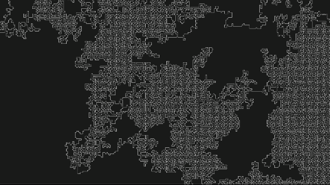

# Maze Generator

Animated maze generator using the recursive backtracking algorithm.



## How It Works

The algorithm generates mazes through the following steps:

1. Start at a random cell and mark it as visited
2. Pick a random unvisited neighbor and carve a path to it
3. Push the current cell to a stack and move to the neighbor
4. If no unvisited neighbors exist, backtrack by popping from the stack
5. Repeat until all cells are visited
6. The maze regenerates automatically after completion

## Props

- **width, height**: Canvas dimensions (defaults to screen size)
- **cellSize**: Size of each grid cell in pixels (default: `10`)
- **backgroundColor**: Canvas background color (default: `"black"`)
- **strokeColor**: Maze line color (default: `"white"`)
- **strokeWeight**: Thickness of maze lines (default: `2`)
- **speed**: Number of cells drawn per animation frame (default: `1`, higher values = faster generation)

## Usage

```jsx
import Maze from './Maze'

// Default settings
<Maze />

// Custom settings
<Maze 
cellSize={7}
backgroundColor="#1a1a1a"
strokeColor="white"
strokeWeight={1.2}
speed={8}
/>
```
